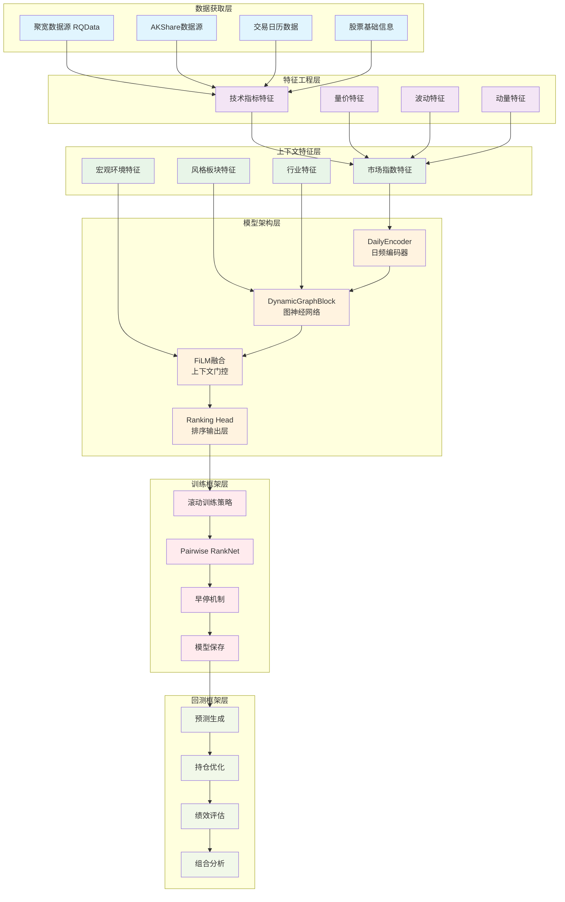
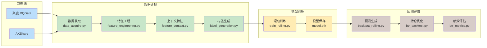
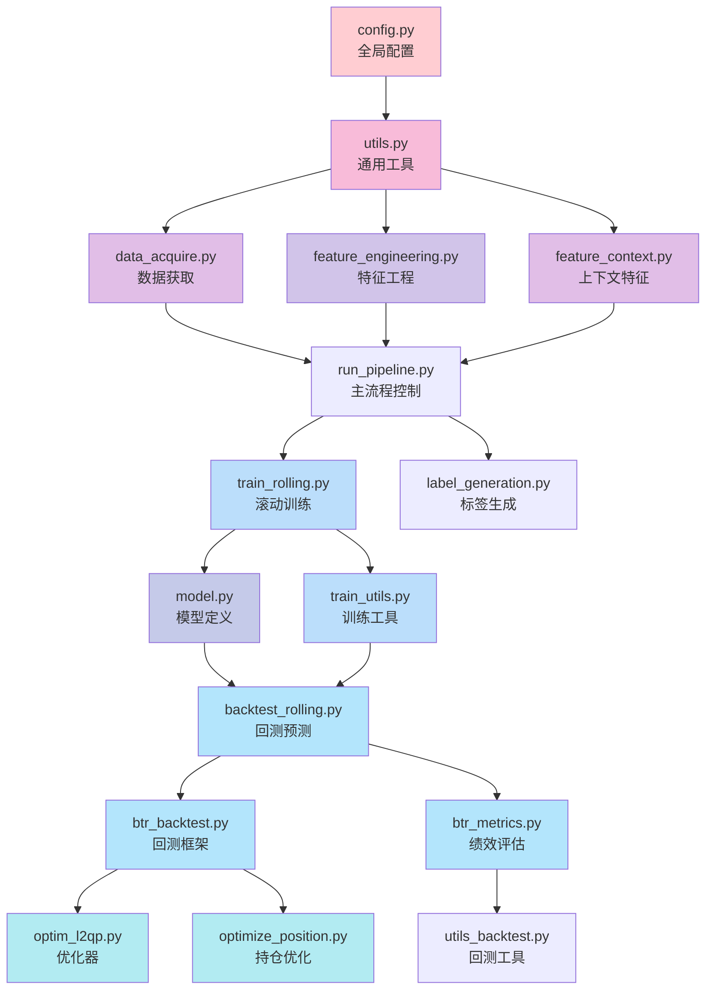
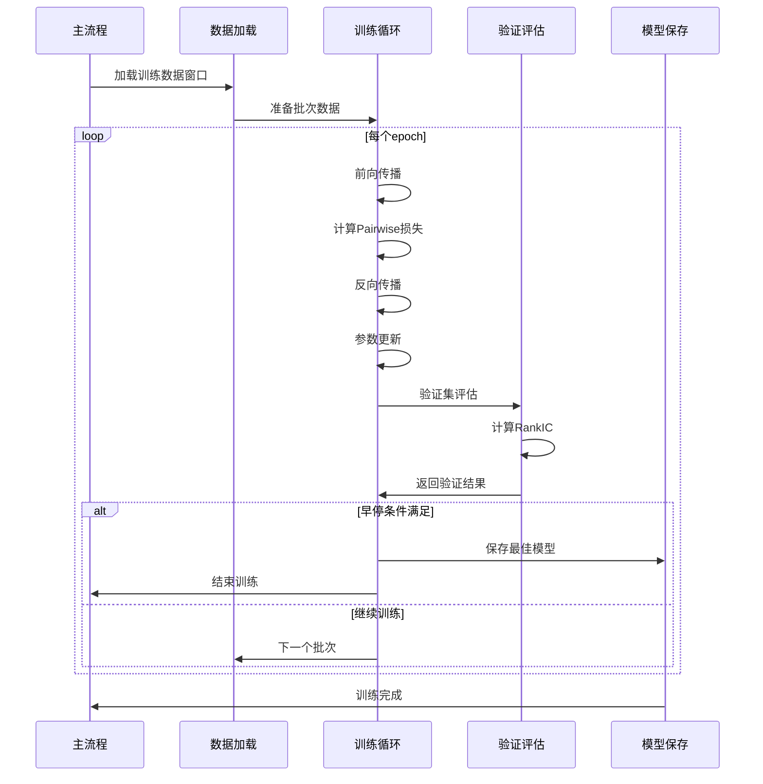

# 架构图可视化

## 系统整体架构



## 数据流架构



## 模块依赖关系



## 模型组件架构

```mermaid
graph TB
    subgraph "输入层"
        I1[股票日频特征]
        I2[市场上下文特征]
        I3[行业图结构]
    end
    
    subgraph "特征编码器"
        E1[DailyEncoder<br/>CNN特征提取]
        E2[时间序列编码]
    end
    
    subgraph "图神经网络"
        G1[DynamicGraphBlock<br/>GAT注意力机制]
        G2[图卷积操作]
        G3[节点特征更新]
    end
    
    subgraph "特征融合"
        F1[FiLM融合<br/>特征线性调制]
        F2[上下文门控]
    end
    
    subgraph "输出层"
        O1[Ranking Head<br/>排序分数]
        O2[股票排名]
    end
    
    I1 --> E1
    I2 --> F1
    I3 --> G1
    
    E1 --> E2
    E2 --> G1
    
    G1 --> G2
    G2 --> G3
    G3 --> F1
    
    F1 --> F2
    F2 --> O1
    O1 --> O2
    
    classDef input fill:#ffebee
    classDef encoder fill:#f3e5f5
    classDef graph fill:#e8f5e8
    classDef fusion fill:#e1f5fe
    classDef output fill:#fff3e0
    
    class I1,I2,I3 input
    class E1,E2 encoder
    class G1,G2,G3 graph
    class F1,F2 fusion
    class O1,O2 output
```

## 训练流程架构



## 文件组织结构

```
Stock-Graph-based-Contextual-Forecasting/
├── 数据层 (Data Layer)
│   ├── data_acquire.py          # 数据获取模块
│   ├── dataset.py               # 数据集定义
│   └── 数据存储文件/
│       ├── stock_price_day.parquet
│       ├── index_price_day.parquet
│       └── sector_price_day.parquet
├── 特征层 (Feature Layer)
│   ├── feature_engineering.py    # 特征工程
│   ├── feature_context.py       # 上下文特征
│   └── label_generation.py      # 标签生成
├── 模型层 (Model Layer)
│   ├── model.py                 # 模型定义
│   └── train_utils.py           # 训练工具
├── 训练层 (Training Layer)
│   ├── train_rolling.py         # 滚动训练
│   └── optim_l2qp.py            # 优化器
├── 回测层 (Backtest Layer)
│   ├── backtest_rolling.py      # 回测预测
│   ├── btr_backtest.py          # 回测框架
│   ├── btr_metrics.py           # 绩效评估
│   └── utils_backtest.py       # 回测工具
├── 工具层 (Utility Layer)
│   ├── utils.py                 # 通用工具
│   └── config.py                # 全局配置
└── 主流程 (Main Pipeline)
    ├── run_pipeline.py          # 主执行流程
    └── combine_s_g.py           # 组合分析
```

这个架构图展示了系统的层次化设计和模块间的依赖关系，帮助理解整个工程的运作机制。